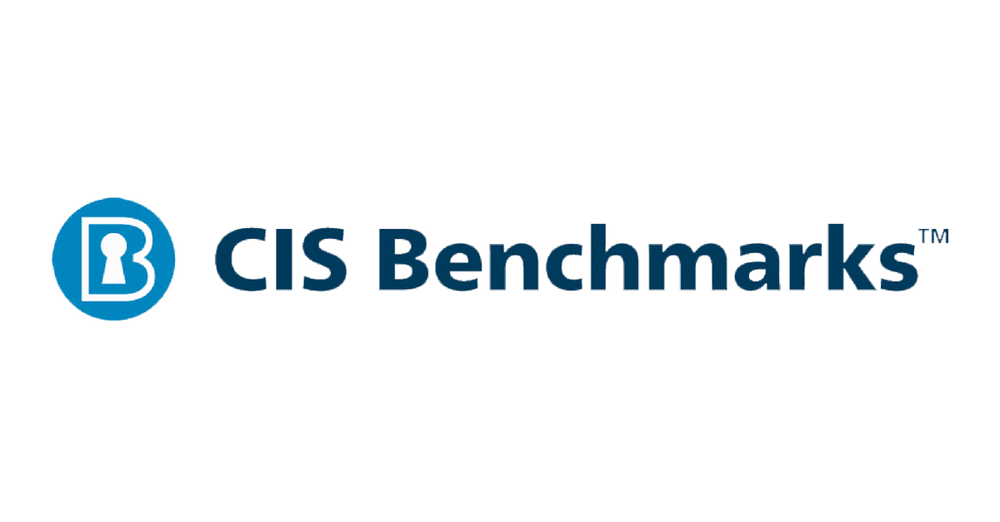

Portfolio
=========

Programming Projects
--------------------

*For access to my private project repositories, please [email me](mailto:richardprice.cyber@gmail.com) with the subject line, GitHub Access.

---
### [Windows Compliance Script | CSCI 301 ](project1)

---
### [DES Encypt/Decrypt | CSCI 452](project2)

---

Ethics Papers
-------------

### [Ethical Implications of AI in Healthcare](/pdf/Ethical Implications of AI in Healthcare.pdf)

-   **Class: CSCI 301**  
-   **Grade: A**

---

Page template forked from <a href="https://github.com/csu-cs/csci-portfolio">CSU-CS</a>

<!-- Remove above link if you don't want to attributive -->
