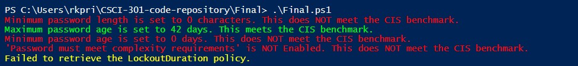
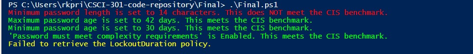

[Back to Portfolio](./)

Windows OS CIS Compliance
===============

-   **Class: 301** 
-   **Grade: A** 
-   **Language(s): Powershell** 
-   **Source Code Repository:** [Click Here](https://github.com/MisterBobsAngryHead/CSCI-301-code-repository/blob/master/Final)  
    (Please email me @ richardprice.cyber@gmail.com to request access.)

## Project description

# 🔐 Windows CIS Password Policy Compliance Checker

This PowerShell script audits local Windows password and account lockout policies against the [CIS (Center for Internet Security)](https://www.cisecurity.org/) Windows security benchmarks.

---

## 📋 What It Does

The script checks the following security settings:

- ✅ **Minimum Password Length** (CIS 1.1.4)
- ✅ **Maximum Password Age** (CIS 1.1.2)
- ✅ **Minimum Password Age** (CIS 1.1.3)
- ✅ **Password Complexity Requirement** (CIS 1.1.5)
- ✅ **Account Lockout Duration** (CIS 1.2.1)

It provides color-coded feedback on whether each policy meets CIS recommendations.

---

## ⚙️ Requirements

- PowerShell (Windows PowerShell or PowerShell Core)
- Administrator privileges (required to run `secedit`)

---

## 🚀 How to Use

1. Open PowerShell **as Administrator**.
2. Save the script to your system as `Final.ps1`.
3. Run the script

  
Fig 1. My initial settings. Very low security.

  
Fig 2. Changed password complexity, length, and age requirements.

[Back to Portfolio](./)
