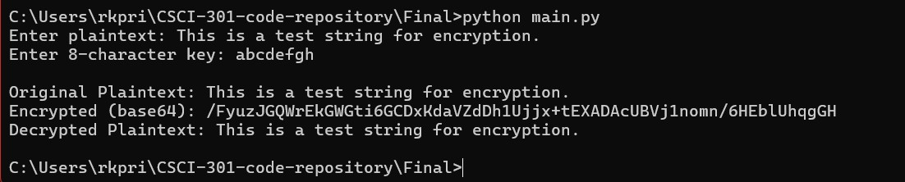
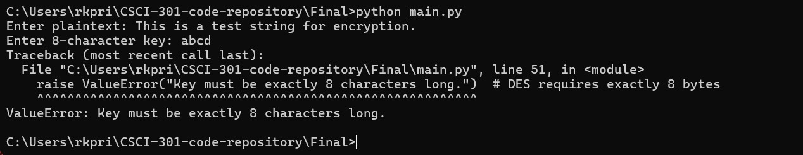

[Back to Portfolio](./)

Project 2 Title
===============

-   **Class: CSCI 452** 
-   **Grade: A** 
-   **Language(s): Python** 
-   **Source Code Repository:** [Click Here](https://github.com/MisterBobsAngryHead/CSCI452)  
    (Please [email me](mailto:richardprice.cyber@gmail.com) to request access.)

## Project description

# 🔐 DES Encryption and Decryption in Python

This is a simple Python script that demonstrates how to encrypt and decrypt messages using the DES (Data Encryption Standard) algorithm in **CBC (Cipher Block Chaining)** mode.

---

## 📦 Requirements

- Python 3.x
- [pycryptodome](https://pypi.org/project/pycryptodome/) library

You can install the required library using pip!

  
Fig 1. Sucessful run!

  
Fig 2. Incorrect encryption key length. Code terminates.

[Back to Portfolio](./)
